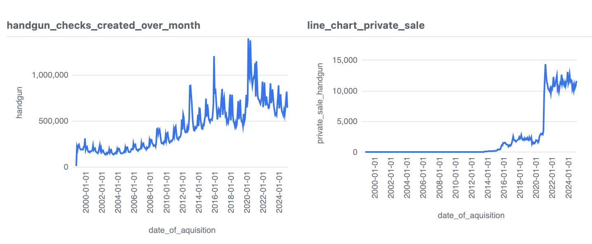
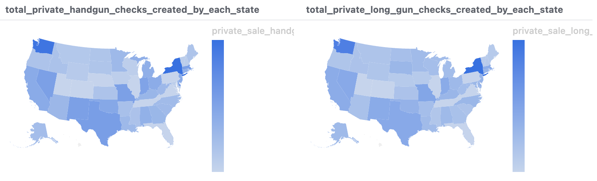
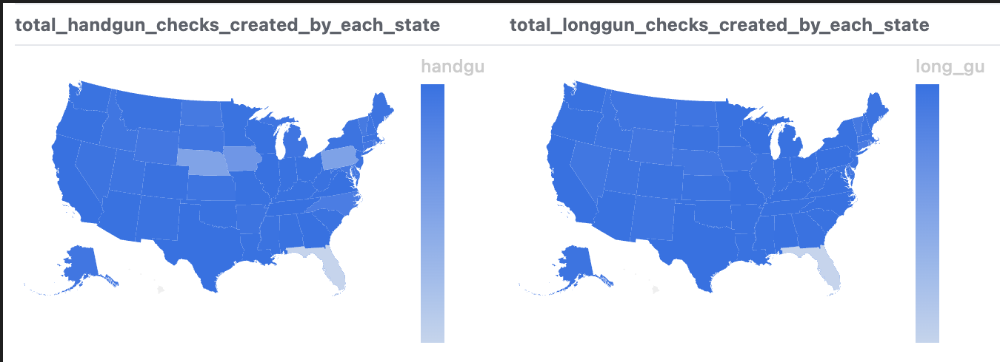

# FBI NICS Firearm Background

The analysis in this repository focuses on firearm acquisition trends. The study aims to understand patterns in firearm checks and their distribution over time. 

> This descriptive analysis showes the number of firearm background checks innitiated through the NICS. NOTE: The number of firearm background checks initiated through the NICS do not represent the number of firearms sold. Based on varying state laws and purchase scenarios.

# Motivation 

Understanding firearm background checks across the U.S. is crucial for policymakers, researchers, and the general public. We can transform raw data into insightful geographic representations, which helps to identify trends, regional disparities, and the impact of policy changes on firearm sales.

# Visualization

 
<em>Figure: Screenshot of checks created over time.</em>

 
<em>Figure: Screenshot of different type of hecks created by each states.</em>

 
<em>Figure: Screenshot of different type of hecks created by each states.</em>

This analysis is designed to provide a descriptive overview of firearm background checks across the United States, offering readers a clear visualization of trends in handgun and long gun purchases by state. By exploring this data, you can gain insights into firearm sales patterns, identify regional differences, and better understand the broader landscape of gun ownership regulations.

# Licensing
- [NICS Federal Firearms Licensee Manual](https://www.fbi.gov/file-repository/nics-firearms-licensee-manual-111811.pdf/view), which details the history and rules of the background-check program.

- [NICS Participation Map](https://www.fbi.gov/file-repository/nics-participation-map.pdf/view), which "depicts each state's level of participation with the NICS."

## Run The Parser Yourself

All the necessary code is open-source. If you'd like to run the parser yourself, you'll need:

- Install Malloy first
- [`firearm.malloynb`](firearm.malloynb), sources all the data tables for the data analysis portion of this repository.

## Questions / Feedback / Improvements

File [an issue](issues), or email ychen7@zagmail.gonzaga.edu.

## Credits

The impetus for this analysis was brought to you by Professor Timothy Olsen for the MSBA622 - Data Science for Business course at Gonzaga University’s Graduate School of Business Administration. I sincerely appreciate the guidance and insights provided throughout this project, which have been instrumental in applying data science methodologies to real-world business challenges. 
